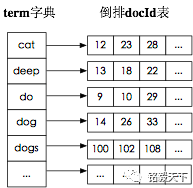
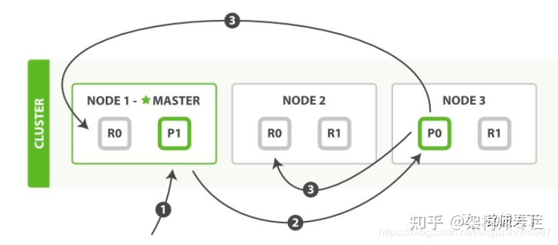
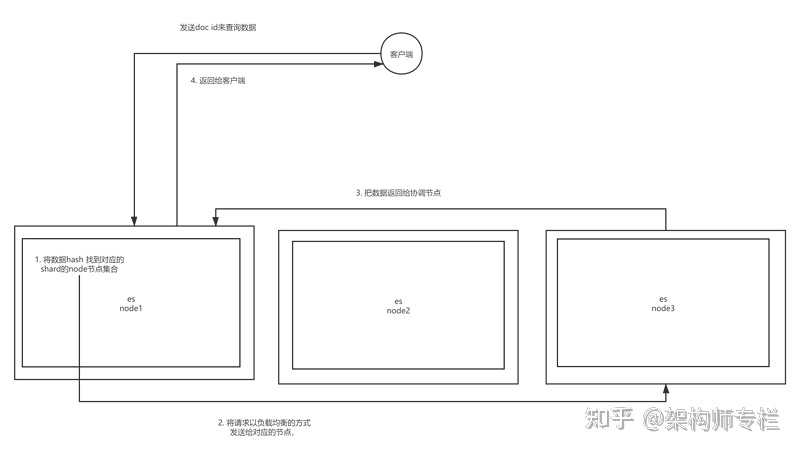
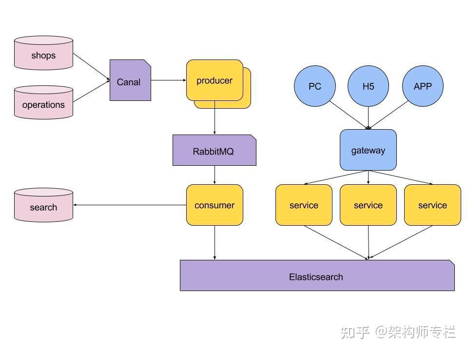

- [x] [110道 ES面试题及答案整理_zhihu](https://zhuanlan.zhihu.com/p/443724132)
- [x] [120 道 ES面试题及答案整理，ES常见面试题（持续更新）_csdn](https://blog.csdn.net/yanpenglei/article/details/121859896)
- [x] [Elasticsearch面经_csdn](https://blog.csdn.net/qq_43703196/article/details/125697126)

------

### 0、Elasticsearch的基本概念

基本概念表(对标MySQL)

**Elasticsearch 是一个分布式、可扩展、实时的搜索与数据分析引擎**。 它能从项目一开始就赋予你的数据以搜索、分析和探索的能力，这是通常没有预料到的。 它存在还因为原始数据如果只是躺在磁盘里面根本就毫无用处。

它可以近乎实时的存储、检索数据；本身扩展性很好，可以扩展到上百台服务器，处理 PB 级别的数据。

### 为什么要使用 Elasticsearch？

系统中的数据， 随着业务的发展，时间的推移， 将会非常多， 而业务中往往采用模糊查询进行数据的搜索， 而模糊查询会导致查询引擎放弃索引，导致系统查询数据时都是全表扫描，在百万级别的数据库中，查询效率是非常低下的，而我们使用 ES 做一个全文索引，将经常查询的系统功能的某些字段，比如说电商系统的商品表中商品名，描述、价格还有 id 这些字段我们放入 ES 索引库里，可以提高查询速度。

### [1、elasticsearch的倒排索引是什么](https://link.zhihu.com/?target=https%3A//gitee.com/souyunku/DevBooks/blob/master/docs/Elasticsearch/Elasticsearch%E6%9C%80%E6%96%B02021%E5%B9%B4%E9%9D%A2%E8%AF%95%E9%A2%98%EF%BC%8C%E9%AB%98%E7%BA%A7%E9%9D%A2%E8%AF%95%E9%A2%98%E5%8F%8A%E9%99%84%E7%AD%94%E6%A1%88%E8%A7%A3%E6%9E%90.md%231elasticsearch%E7%9A%84%E5%80%92%E6%8E%92%E7%B4%A2%E5%BC%95%E6%98%AF%E4%BB%80%E4%B9%88)

面试官：想了解你对基础概念的认知。

通俗解释一下就可以。

传统的我们的检索是通过文章，逐个遍历找到对应关键词的位置。

而倒排索引，是通过分词策略，形成了词和文章的映射关系表，这种词典+映射表即为倒排索引。

有了倒排索引，就能实现o（1）时间复杂度的效率检索文章了，极大的提高了检索效率。

学术的解答方式：

倒排索引，相反于一篇文章包含了哪些词，它从词出发，记载了这个词在哪些文档中出现过，由两部分组成——词典和倒排表。

加分项：倒排索引的底层实现是基于：FST（Finite State Transducer）数据结构。

lucene从4+版本后开始大量使用的数据结构是FST。FST有两个优点：

**1、** 空间占用小。通过对词典中单词前缀和后缀的重复利用，压缩了存储空间；

**2、** 查询速度快。O(len(str))的查询时间复杂度。

### [elasticsearch 全文检索](https://gitee.com/souyunku/NewDevBooks/blob/master/docs/Elasticsearch/Elasticsearch中级面试题汇总及答案（2021年Elasticsearch面试题及答案大全）.md#9elasticsearch-全文检索)

(1) 客户端使用RestFul API向对应的node发送查询请求

(2)协调节点将请求转发到所有节点（primary或者replica）所有节点将对应的数据查询之后返回对应的doc id 返回给协调节点

(3)协调节点将doc进行排序聚合

(4) 协调节点再根据doc id 把查询请求发送到对应shard的node，返回document

### [2、Elasticsearch 在部署时，对 Linux 的设置有哪些优化方法](https://link.zhihu.com/?target=https%3A//gitee.com/souyunku/DevBooks/blob/master/docs/Elasticsearch/Elasticsearch%E6%9C%80%E6%96%B02021%E5%B9%B4%E9%9D%A2%E8%AF%95%E9%A2%98%EF%BC%8C%E9%AB%98%E7%BA%A7%E9%9D%A2%E8%AF%95%E9%A2%98%E5%8F%8A%E9%99%84%E7%AD%94%E6%A1%88%E8%A7%A3%E6%9E%90.md%232elasticsearch-%E5%9C%A8%E9%83%A8%E7%BD%B2%E6%97%B6%E5%AF%B9-linux-%E7%9A%84%E8%AE%BE%E7%BD%AE%E6%9C%89%E5%93%AA%E4%BA%9B%E4%BC%98%E5%8C%96%E6%96%B9%E6%B3%95)

面试官：想了解对 ES 集群的运维能力。

解

**1、** 关闭缓存 swap;

**2、** 堆内存设置为：Min（节点内存/2, 32GB）;

**3、** 设置最大文件句柄数；

**4、** 线程池+队列大小根据业务需要做调整；

**5、** 磁盘存储 raid 方式——存储有条件使用 RAID10，增加单节点性能以及避免单

节点存储故障。

### [3、详细描述一下Elasticsearch索引文档的过程](https://link.zhihu.com/?target=https%3A//gitee.com/souyunku/DevBooks/blob/master/docs/Elasticsearch/Elasticsearch%E6%9C%80%E6%96%B02021%E5%B9%B4%E9%9D%A2%E8%AF%95%E9%A2%98%EF%BC%8C%E9%AB%98%E7%BA%A7%E9%9D%A2%E8%AF%95%E9%A2%98%E5%8F%8A%E9%99%84%E7%AD%94%E6%A1%88%E8%A7%A3%E6%9E%90.md%233%E8%AF%A6%E7%BB%86%E6%8F%8F%E8%BF%B0%E4%B8%80%E4%B8%8Belasticsearch%E7%B4%A2%E5%BC%95%E6%96%87%E6%A1%A3%E7%9A%84%E8%BF%87%E7%A8%8B)

面试官：想了解ES的底层原理，不再只关注业务层面了。

这里的索引文档应该理解为文档写入ES，创建索引的过程。

文档写入包含：单文档写入和批量bulk写入，这里只解释一下：单文档写入流程。

记住官方文档中的这个图。

第一步：客户写集群某节点写入数据，发送请求。（如果没有指定路由/协调节点，请求的节点扮演路由节点的角色。）

第二步：节点1接受到请求后，使用文档_id来确定文档属于分片0。请求会被转到另外的节点，假定节点3。因此分片0的主分片分配到节点3上。

第三步：节点3在主分片上执行写操作，如果成功，则将请求并行转发到节点1和节点2的副本分片上，等待结果返回。所有的副本分片都报告成功，节点3将向协调节点（节点1）报告成功，节点1向请求客户端报告写入成功。

如果面试官再问：第二步中的文档获取分片的过程？

回借助路由算法获取，路由算法就是根据路由和文档id计算目标的分片id的过程。

1shard = hash(_routing) % (num_of_primary_shards)

### [4、在并发情况下，Elasticsearch 如果保证读写一致？](https://link.zhihu.com/?target=https%3A//gitee.com/souyunku/DevBooks/blob/master/docs/Elasticsearch/Elasticsearch%E6%9C%80%E6%96%B02021%E5%B9%B4%E9%9D%A2%E8%AF%95%E9%A2%98%EF%BC%8C%E9%AB%98%E7%BA%A7%E9%9D%A2%E8%AF%95%E9%A2%98%E5%8F%8A%E9%99%84%E7%AD%94%E6%A1%88%E8%A7%A3%E6%9E%90.md%234%E5%9C%A8%E5%B9%B6%E5%8F%91%E6%83%85%E5%86%B5%E4%B8%8Belasticsearch-%E5%A6%82%E6%9E%9C%E4%BF%9D%E8%AF%81%E8%AF%BB%E5%86%99%E4%B8%80%E8%87%B4)

**1、** 可以通过版本号使用乐观并发控制，以确保新版本不会被旧版本覆盖，**由应用**

**层来处理具体的冲突；**

**2、** 另外对于写操作，一致性级别支持 quorum/one/all，默认为 quorum，即只有当大多数分片可用时才允许写操作。但即使大多数可用，也可能存在因为网络等原因导致写入副本失败，这样该副本被认为故障，分片将会在一个不同的节点

上重建。

**3、** 对于读操作，可以设置 replication 为 sync(默认)，这使得操作在主分片和副本分片都完成后才会返回；如果设置 replication 为 async 时，也可以通过设置搜索请求参数_preference 为 primary 来查询主分片，确保文档是最新版本。

### [5、请解释在 Elasticsearch 集群中添加或创建索引的过程？](https://link.zhihu.com/?target=https%3A//gitee.com/souyunku/DevBooks/blob/master/docs/Elasticsearch/Elasticsearch%E6%9C%80%E6%96%B02021%E5%B9%B4%E9%9D%A2%E8%AF%95%E9%A2%98%EF%BC%8C%E9%AB%98%E7%BA%A7%E9%9D%A2%E8%AF%95%E9%A2%98%E5%8F%8A%E9%99%84%E7%AD%94%E6%A1%88%E8%A7%A3%E6%9E%90.md%235%E8%AF%B7%E8%A7%A3%E9%87%8A%E5%9C%A8-elasticsearch-%E9%9B%86%E7%BE%A4%E4%B8%AD%E6%B7%BB%E5%8A%A0%E6%88%96%E5%88%9B%E5%BB%BA%E7%B4%A2%E5%BC%95%E7%9A%84%E8%BF%87%E7%A8%8B)

要添加新索引，应使用创建索引 API 选项。创建索引所需的参数是索引的配置Settings，索引中的字段 Mapping 以及索引别名 Alias。

也可以通过模板 Template 创建索引。

### [6、安装 Elasticsearch 需要依赖什么组件吗？](https://link.zhihu.com/?target=https%3A//gitee.com/souyunku/DevBooks/blob/master/docs/Elasticsearch/Elasticsearch%E6%9C%80%E6%96%B02021%E5%B9%B4%E9%9D%A2%E8%AF%95%E9%A2%98%EF%BC%8C%E9%AB%98%E7%BA%A7%E9%9D%A2%E8%AF%95%E9%A2%98%E5%8F%8A%E9%99%84%E7%AD%94%E6%A1%88%E8%A7%A3%E6%9E%90.md%236%E5%AE%89%E8%A3%85-elasticsearch-%E9%9C%80%E8%A6%81%E4%BE%9D%E8%B5%96%E4%BB%80%E4%B9%88%E7%BB%84%E4%BB%B6%E5%90%97)

ES 早期版本需要JDK，在7.X版本后已经集成了 JDK，已无需第三方依赖。

### [7、如何使用 Elastic Reporting ？](https://link.zhihu.com/?target=https%3A//gitee.com/souyunku/DevBooks/blob/master/docs/Elasticsearch/Elasticsearch%E6%9C%80%E6%96%B02021%E5%B9%B4%E9%9D%A2%E8%AF%95%E9%A2%98%EF%BC%8C%E9%AB%98%E7%BA%A7%E9%9D%A2%E8%AF%95%E9%A2%98%E5%8F%8A%E9%99%84%E7%AD%94%E6%A1%88%E8%A7%A3%E6%9E%90.md%237%E5%A6%82%E4%BD%95%E4%BD%BF%E7%94%A8-elastic-reporting-)

收费功能，只是了解，点到为止。

Reporting API有助于将检索结果生成 PD F格式，图像 PNG 格式以及电子表格 CSV 格式的数据，并可根据需要进行共享或保存。

### [8、elasticsearch 是如何实现 master 选举的](https://link.zhihu.com/?target=https%3A//gitee.com/souyunku/DevBooks/blob/master/docs/Elasticsearch/Elasticsearch%E6%9C%80%E6%96%B02021%E5%B9%B4%E9%9D%A2%E8%AF%95%E9%A2%98%EF%BC%8C%E9%AB%98%E7%BA%A7%E9%9D%A2%E8%AF%95%E9%A2%98%E5%8F%8A%E9%99%84%E7%AD%94%E6%A1%88%E8%A7%A3%E6%9E%90.md%238elasticsearch-%E6%98%AF%E5%A6%82%E4%BD%95%E5%AE%9E%E7%8E%B0-master-%E9%80%89%E4%B8%BE%E7%9A%84)

面试官：想了解 ES 集群的底层原理，不再只关注业务层面了。

解

**前置前提：**

**1、** 只有候选主节点（master：true）的节点才能成为主节点。

**2、** 最小主节点数（min_master_nodes）的目的是防止脑裂。

这个我看了各种网上分析的版本和源码分析的书籍，云里雾里。核对了一下代码，核心入口为 findMaster，选择主节点成功返回对应 Master，否则返回 null。

**选举流程大致描述如下：**

第一步：确认候选主节点数达标，elasticsearch.yml 设置的值

discovery.zen.minimum_master_nodes；

第二步：比较：先判定是否具备 master 资格，具备候选主节点资格的优先返回；

若两节点都为候选主节点，则 id 小的值会主节点。

注意这里的 id 为 string 类型。

题外话：获取节点 id 的方法。

1GET /_cat/nodes?v&h=ip,port,heapPercent,heapMax,id,name 2ip port heapPercent heapMax id name

### [9、在并发情况下，Elasticsearch如果保证读写一致？](https://link.zhihu.com/?target=https%3A//gitee.com/souyunku/DevBooks/blob/master/docs/Elasticsearch/Elasticsearch%E6%9C%80%E6%96%B02021%E5%B9%B4%E9%9D%A2%E8%AF%95%E9%A2%98%EF%BC%8C%E9%AB%98%E7%BA%A7%E9%9D%A2%E8%AF%95%E9%A2%98%E5%8F%8A%E9%99%84%E7%AD%94%E6%A1%88%E8%A7%A3%E6%9E%90.md%239%E5%9C%A8%E5%B9%B6%E5%8F%91%E6%83%85%E5%86%B5%E4%B8%8Belasticsearch%E5%A6%82%E6%9E%9C%E4%BF%9D%E8%AF%81%E8%AF%BB%E5%86%99%E4%B8%80%E8%87%B4)

**1、** 可以通过版本号使用乐观并发控制，以确保新版本不会被旧版本覆盖，由应用层来处理具体的冲突；

**2、** 另外对于写操作，一致性级别支持quorum/one/all，默认为quorum，即只有当大多数分片可用时才允许写操作。但即使大多数可用，也可能存在因为网络等原因导致写入副本失败，这样该副本被认为故障，分片将会在一个不同的节点上重建。

**3、** 对于读操作，可以设置replication为sync(默认)，这使得操作在主分片和副本分片都完成后才会返回；如果设置replication为async时，也可以通过设置搜索请求参数_preference为primary来查询主分片，确保文档是最新版本。

### [10、详细描述一下Elasticsearch更新和删除文档的过程。](https://link.zhihu.com/?target=https%3A//gitee.com/souyunku/DevBooks/blob/master/docs/Elasticsearch/Elasticsearch%E6%9C%80%E6%96%B02021%E5%B9%B4%E9%9D%A2%E8%AF%95%E9%A2%98%EF%BC%8C%E9%AB%98%E7%BA%A7%E9%9D%A2%E8%AF%95%E9%A2%98%E5%8F%8A%E9%99%84%E7%AD%94%E6%A1%88%E8%A7%A3%E6%9E%90.md%2310%E8%AF%A6%E7%BB%86%E6%8F%8F%E8%BF%B0%E4%B8%80%E4%B8%8Belasticsearch%E6%9B%B4%E6%96%B0%E5%92%8C%E5%88%A0%E9%99%A4%E6%96%87%E6%A1%A3%E7%9A%84%E8%BF%87%E7%A8%8B%E3%80%82)

**1、** 删除和更新也都是写操作，但是Elasticsearch中的文档是不可变的，因此不能被删除或者改动以展示其变更；

**2、** 磁盘上的每个段都有一个相应的.del文件。当删除请求发送后，文档并没有真的被删除，而是在.del文件中被标记为删除。该文档依然能匹配查询，但是会在结果中被过滤掉。当段合并时，在.del文件中被标记为删除的文档将不会被写入新段。

**3、** 在新的文档被创建时，Elasticsearch会为该文档指定一个版本号，当执行更新时，旧版本的文档在.del文件中被标记为删除，新版本的文档被索引到一个新段。旧版本的文档依然能匹配查询，但是会在结果中被过滤掉。

### 1[1、elasticsearch 读取数据](https://link.zhihu.com/?target=https%3A//gitee.com/souyunku/DevBooks/blob/master/docs/Elasticsearch/Elasticsearch%E6%9C%80%E6%96%B02021%E5%B9%B4%E9%9D%A2%E8%AF%95%E9%A2%98%E5%A4%A7%E6%B1%87%E6%80%BB%EF%BC%8C%E9%99%84%E7%AD%94%E6%A1%88.md%231elasticsearch-%E8%AF%BB%E5%8F%96%E6%95%B0%E6%8D%AE)

使用RestFul API向对应的node发送查询请求，根据did来判断在哪个shard上，返回的是primary和replica的node节点集合

这样会负载均衡地把查询发送到对应节点，之后对应节点接收到请求，将document数据返回协调节点，协调节点把document返回给客户端

### 1[2、您能解释一下X-Pack for Elasticsearch的功能和重要性吗？](https://link.zhihu.com/?target=https%3A//gitee.com/souyunku/DevBooks/blob/master/docs/Elasticsearch/Elasticsearch%E6%9C%80%E6%96%B02021%E5%B9%B4%E9%9D%A2%E8%AF%95%E9%A2%98%E5%A4%A7%E6%B1%87%E6%80%BB%EF%BC%8C%E9%99%84%E7%AD%94%E6%A1%88.md%232%E6%82%A8%E8%83%BD%E8%A7%A3%E9%87%8A%E4%B8%80%E4%B8%8Bx-pack-for-elasticsearch%E7%9A%84%E5%8A%9F%E8%83%BD%E5%92%8C%E9%87%8D%E8%A6%81%E6%80%A7%E5%90%97)

X-Pack 是与Elasticsearch一起安装的扩展程序。

X-Pack的各种功能包括安全性（基于角色的访问，特权/权限，角色和用户安全性），监视，报告，警报等。

### 1[3、Elasticsearch 中的节点（比如共 20 个），其中的 10 个选了一个master，另外 10 个选了另一个 master，怎么办？](https://link.zhihu.com/?target=https%3A//gitee.com/souyunku/DevBooks/blob/master/docs/Elasticsearch/Elasticsearch%E6%9C%80%E6%96%B02021%E5%B9%B4%E9%9D%A2%E8%AF%95%E9%A2%98%E5%A4%A7%E6%B1%87%E6%80%BB%EF%BC%8C%E9%99%84%E7%AD%94%E6%A1%88.md%233elasticsearch-%E4%B8%AD%E7%9A%84%E8%8A%82%E7%82%B9%E6%AF%94%E5%A6%82%E5%85%B1-20-%E4%B8%AA%E5%85%B6%E4%B8%AD%E7%9A%84-10-%E4%B8%AA%E9%80%89%E4%BA%86%E4%B8%80%E4%B8%AAmaster%E5%8F%A6%E5%A4%96-10-%E4%B8%AA%E9%80%89%E4%BA%86%E5%8F%A6%E4%B8%80%E4%B8%AA-master%E6%80%8E%E4%B9%88%E5%8A%9E)

**1、** 当集群 master 候选数量不小于 3 个时，可以通过设置最少投票通过数量（discovery.zen.minimum_master_nodes）超过所有候选节点一半以上来解决脑裂问题；

**2、** 当候选数量为两个时，只能修改为唯一的一个 master 候选，其他作为 data节点，避免脑裂问题。

### 1[4、解释一下 Elasticsearch集群中的 索引的概念 ？](https://link.zhihu.com/?target=https%3A//gitee.com/souyunku/DevBooks/blob/master/docs/Elasticsearch/Elasticsearch%E6%9C%80%E6%96%B02021%E5%B9%B4%E9%9D%A2%E8%AF%95%E9%A2%98%E5%A4%A7%E6%B1%87%E6%80%BB%EF%BC%8C%E9%99%84%E7%AD%94%E6%A1%88.md%234%E8%A7%A3%E9%87%8A%E4%B8%80%E4%B8%8B-elasticsearch%E9%9B%86%E7%BE%A4%E4%B8%AD%E7%9A%84-%E7%B4%A2%E5%BC%95%E7%9A%84%E6%A6%82%E5%BF%B5-)

Elasticsearch 集群可以包含多个索引，与关系数据库相比，它们相当于数据库表

### 1[5、你可以列出 Elasticsearch 各种类型的分析器吗？](https://link.zhihu.com/?target=https%3A//gitee.com/souyunku/DevBooks/blob/master/docs/Elasticsearch/Elasticsearch%E6%9C%80%E6%96%B02021%E5%B9%B4%E9%9D%A2%E8%AF%95%E9%A2%98%E5%A4%A7%E6%B1%87%E6%80%BB%EF%BC%8C%E9%99%84%E7%AD%94%E6%A1%88.md%235%E4%BD%A0%E5%8F%AF%E4%BB%A5%E5%88%97%E5%87%BA-elasticsearch-%E5%90%84%E7%A7%8D%E7%B1%BB%E5%9E%8B%E7%9A%84%E5%88%86%E6%9E%90%E5%99%A8%E5%90%97)

Elasticsearch Analyzer 的类型为内置分析器和自定义分析器。

**Standard Analyzer**

标准分析器是默认分词器，如果未指定，则使用该分词器。

它基于Unicode文本分割算法，适用于大多数语言。

**Whitespace Analyzer**

基于空格字符切词。

**Stop Analyzer**

在simple Analyzer的基础上，移除停用词。

**Keyword Analyzer**

不切词，将输入的整个串一起返回。

自定义分词器的模板

自定义分词器的在Mapping的Setting部分设置：

PUT my_custom_index { "settings":{ "analysis":{ "char_filter":{}, "tokenizer":{}, "filter":{}, "analyzer":{} } } }

脑海中还是上面的三部分组成的图示。其中：

“char_filter”:{},——对应字符过滤部分；

“tokenizer”:{},——对应文本切分为分词部分；

“filter”:{},——对应分词后再过滤部分；

“analyzer”:{}——对应分词器组成部分，其中会包含：1. 2. 3。

### 1[6、解释一下 Elasticsearch Node？](https://link.zhihu.com/?target=https%3A//gitee.com/souyunku/DevBooks/blob/master/docs/Elasticsearch/Elasticsearch%E6%9C%80%E6%96%B02021%E5%B9%B4%E9%9D%A2%E8%AF%95%E9%A2%98%E5%A4%A7%E6%B1%87%E6%80%BB%EF%BC%8C%E9%99%84%E7%AD%94%E6%A1%88.md%236%E8%A7%A3%E9%87%8A%E4%B8%80%E4%B8%8B-elasticsearch-node)

节点是 Elasticsearch 的实例。实际业务中，我们会说：ES集群包含3个节点、7个节点。

这里节点实际就是：一个独立的 Elasticsearch 进程，一般将一个节点部署到一台独立的服务器或者虚拟机、容器中。

不同节点根据角色不同，可以划分为：

**主节点**

帮助配置和管理在整个集群中添加和删除节点。

**数据节点**

存储数据并执行诸如CRUD（创建/读取/更新/删除）操作，对数据进行搜索和聚合的操作。

**1、** 客户端节点（或者说：协调节点） 将集群请求转发到主节点，将与数据相关的请求转发到数据节点

**2、** 摄取节点

用于在索引之前对文档进行预处理。

### 1[7、在安装Elasticsearch时，请说明不同的软件包及其重要性？](https://link.zhihu.com/?target=https%3A//gitee.com/souyunku/DevBooks/blob/master/docs/Elasticsearch/Elasticsearch%E6%9C%80%E6%96%B02021%E5%B9%B4%E9%9D%A2%E8%AF%95%E9%A2%98%E5%A4%A7%E6%B1%87%E6%80%BB%EF%BC%8C%E9%99%84%E7%AD%94%E6%A1%88.md%237%E5%9C%A8%E5%AE%89%E8%A3%85elasticsearch%E6%97%B6%E8%AF%B7%E8%AF%B4%E6%98%8E%E4%B8%8D%E5%90%8C%E7%9A%84%E8%BD%AF%E4%BB%B6%E5%8C%85%E5%8F%8A%E5%85%B6%E9%87%8D%E8%A6%81%E6%80%A7)

这个貌似没什么好说的，去官方文档下载对应操作系统安装包即可。

部分功能是收费的，如机器学习、高级别 kerberos 认证安全等选型要知悉。

### 1[8、Elasticsearch在部署时，对Linux的设置有哪些优化方法](https://link.zhihu.com/?target=https%3A//gitee.com/souyunku/DevBooks/blob/master/docs/Elasticsearch/Elasticsearch%E6%9C%80%E6%96%B02021%E5%B9%B4%E9%9D%A2%E8%AF%95%E9%A2%98%E5%A4%A7%E6%B1%87%E6%80%BB%EF%BC%8C%E9%99%84%E7%AD%94%E6%A1%88.md%238elasticsearch%E5%9C%A8%E9%83%A8%E7%BD%B2%E6%97%B6%E5%AF%B9linux%E7%9A%84%E8%AE%BE%E7%BD%AE%E6%9C%89%E5%93%AA%E4%BA%9B%E4%BC%98%E5%8C%96%E6%96%B9%E6%B3%95)

面试官：想了解对ES集群的运维能力。

**1、** 关闭缓存swap;

**2、** 堆内存设置为：Min（节点内存/2, 32GB）;

**3、** 设置最大文件句柄数；

**4、** 线程池+队列大小根据业务需要做调整；

**5、** 磁盘存储raid方式——存储有条件使用RAID10，增加单节点性能以及避免单节点存储故障。

### 1[9、请解释有关 Elasticsearch的 NRT？](https://link.zhihu.com/?target=https%3A//gitee.com/souyunku/DevBooks/blob/master/docs/Elasticsearch/Elasticsearch%E6%9C%80%E6%96%B02021%E5%B9%B4%E9%9D%A2%E8%AF%95%E9%A2%98%E5%A4%A7%E6%B1%87%E6%80%BB%EF%BC%8C%E9%99%84%E7%AD%94%E6%A1%88.md%239%E8%AF%B7%E8%A7%A3%E9%87%8A%E6%9C%89%E5%85%B3-elasticsearch%E7%9A%84-nrt)

从文档索引（写入）到可搜索到之间的延迟默认一秒钟，因此Elasticsearch是近实时（NRT）搜索平台。

也就是说：文档写入，最快一秒钟被索引到，不能再快了。

写入调优的时候，我们通常会动态调整：refresh_interval = 30s 或者更达值，以使得写入数据更晚一点时间被搜索到。

### [20、elasticsearch 的 document设计](https://link.zhihu.com/?target=https%3A//gitee.com/souyunku/DevBooks/blob/master/docs/Elasticsearch/Elasticsearch%E6%9C%80%E6%96%B02021%E5%B9%B4%E9%9D%A2%E8%AF%95%E9%A2%98%E5%A4%A7%E6%B1%87%E6%80%BB%EF%BC%8C%E9%99%84%E7%AD%94%E6%A1%88.md%2310elasticsearch-%E7%9A%84-document%E8%AE%BE%E8%AE%A1)

在使用es时 避免使用复杂的查询语句（Join 、聚合），就是在建立索引时，

就根据查询语句建立好对应的元数据。

### 2[1、Kibana在Elasticsearch的哪些地方以及如何使用？](https://link.zhihu.com/?target=https%3A//gitee.com/souyunku/DevBooks/blob/master/docs/Elasticsearch/Elasticsearch%E6%9C%80%E6%96%B0%E9%9D%A2%E8%AF%95%E9%A2%98%EF%BC%8C2021%E5%B9%B4%E9%9D%A2%E8%AF%95%E9%A2%98%E5%8F%8A%E7%AD%94%E6%A1%88%E6%B1%87%E6%80%BB.md%231kibana%E5%9C%A8elasticsearch%E7%9A%84%E5%93%AA%E4%BA%9B%E5%9C%B0%E6%96%B9%E4%BB%A5%E5%8F%8A%E5%A6%82%E4%BD%95%E4%BD%BF%E7%94%A8)

Kibana是ELK Stack –日志分析解决方案的一部分。

它是一种开放源代码的可视化工具，可以以拖拽、自定义图表的方式直观分析数据，极大降低的数据分析的门槛。

未来会向类似：商业智能和分析软件 - Tableau 发展。

### 2[2、elasticsearch是如何实现master选举的](https://link.zhihu.com/?target=https%3A//gitee.com/souyunku/DevBooks/blob/master/docs/Elasticsearch/Elasticsearch%E6%9C%80%E6%96%B0%E9%9D%A2%E8%AF%95%E9%A2%98%EF%BC%8C2021%E5%B9%B4%E9%9D%A2%E8%AF%95%E9%A2%98%E5%8F%8A%E7%AD%94%E6%A1%88%E6%B1%87%E6%80%BB.md%232elasticsearch%E6%98%AF%E5%A6%82%E4%BD%95%E5%AE%9E%E7%8E%B0master%E9%80%89%E4%B8%BE%E7%9A%84)

面试官：想了解ES集群的底层原理，不再只关注业务层面了。

**前置前提：**

**1、** 只有候选主节点（master：true）的节点才能成为主节点。

**2、** 最小主节点数（min_master_nodes）的目的是防止脑裂。

这个我看了各种网上分析的版本和源码分析的书籍，云里雾里。

核对了一下代码，核心入口为findMaster，选择主节点成功返回对应Master，否则返回null。选举流程大致描述如下：

第一步：确认候选主节点数达标，elasticsearch.yml设置的值discovery.zen.minimum_master_nodes；

第二步：比较：先判定是否具备master资格，具备候选主节点资格的优先返回；若两节点都为候选主节点，则id小的值会主节点。注意这里的id为string类型。

题外话：获取节点id的方法。

1GET /_cat/nodes?v&h=ip,port,heapPercent,heapMax,id,name 2ip port heapPercent heapMax id name

### 2[3、客户端在和集群连接时，是如何选择特定的节点执行请求的？](https://link.zhihu.com/?target=https%3A//gitee.com/souyunku/DevBooks/blob/master/docs/Elasticsearch/Elasticsearch%E6%9C%80%E6%96%B0%E9%9D%A2%E8%AF%95%E9%A2%98%EF%BC%8C2021%E5%B9%B4%E9%9D%A2%E8%AF%95%E9%A2%98%E5%8F%8A%E7%AD%94%E6%A1%88%E6%B1%87%E6%80%BB.md%233%E5%AE%A2%E6%88%B7%E7%AB%AF%E5%9C%A8%E5%92%8C%E9%9B%86%E7%BE%A4%E8%BF%9E%E6%8E%A5%E6%97%B6%E6%98%AF%E5%A6%82%E4%BD%95%E9%80%89%E6%8B%A9%E7%89%B9%E5%AE%9A%E7%9A%84%E8%8A%82%E7%82%B9%E6%89%A7%E8%A1%8C%E8%AF%B7%E6%B1%82%E7%9A%84)

TransportClient利用transport模块远程连接一个ElasticSearch集群。它并不加入到集群中，只是简单的获得一个或者多个初始化的transport地址，并以轮询的方式与这些地址进行通信。

### 2[4、你能告诉我 Elasticsearch 中的数据存储功能吗？](https://link.zhihu.com/?target=https%3A//gitee.com/souyunku/DevBooks/blob/master/docs/Elasticsearch/Elasticsearch%E6%9C%80%E6%96%B0%E9%9D%A2%E8%AF%95%E9%A2%98%EF%BC%8C2021%E5%B9%B4%E9%9D%A2%E8%AF%95%E9%A2%98%E5%8F%8A%E7%AD%94%E6%A1%88%E6%B1%87%E6%80%BB.md%234%E4%BD%A0%E8%83%BD%E5%91%8A%E8%AF%89%E6%88%91-elasticsearch-%E4%B8%AD%E7%9A%84%E6%95%B0%E6%8D%AE%E5%AD%98%E5%82%A8%E5%8A%9F%E8%83%BD%E5%90%97)

Elasticsearch是一个搜索引擎，输入写入ES的过程就是索引化的过程，数据按照既定的 Mapping 序列化为Json 文档实现存储。

### 2[5、Master 节点和 候选 Master节点有什么区别？](https://link.zhihu.com/?target=https%3A//gitee.com/souyunku/DevBooks/blob/master/docs/Elasticsearch/Elasticsearch%E6%9C%80%E6%96%B0%E9%9D%A2%E8%AF%95%E9%A2%98%EF%BC%8C2021%E5%B9%B4%E9%9D%A2%E8%AF%95%E9%A2%98%E5%8F%8A%E7%AD%94%E6%A1%88%E6%B1%87%E6%80%BB.md%235master-%E8%8A%82%E7%82%B9%E5%92%8C-%E5%80%99%E9%80%89-master%E8%8A%82%E7%82%B9%E6%9C%89%E4%BB%80%E4%B9%88%E5%8C%BA%E5%88%AB)

主节点负责集群相关的操作，例如创建或删除索引，跟踪哪些节点是集群的一部分，以及决定将哪些分片分配给哪些节点。

拥有稳定的主节点是衡量集群健康的重要标志。

而候选主节点是被选具备候选资格，可以被选为主节点的那些节点。

### 2[6、介绍下你们电商搜索的整体技术架构。](https://link.zhihu.com/?target=https%3A//gitee.com/souyunku/DevBooks/blob/master/docs/Elasticsearch/Elasticsearch%E6%9C%80%E6%96%B0%E9%9D%A2%E8%AF%95%E9%A2%98%EF%BC%8C2021%E5%B9%B4%E9%9D%A2%E8%AF%95%E9%A2%98%E5%8F%8A%E7%AD%94%E6%A1%88%E6%B1%87%E6%80%BB.md%236%E4%BB%8B%E7%BB%8D%E4%B8%8B%E4%BD%A0%E4%BB%AC%E7%94%B5%E5%95%86%E6%90%9C%E7%B4%A2%E7%9A%84%E6%95%B4%E4%BD%93%E6%8A%80%E6%9C%AF%E6%9E%B6%E6%9E%84%E3%80%82)

### 2[7、客户端在和集群连接时，如何选择特定的节点执行请求的？](https://link.zhihu.com/?target=https%3A//gitee.com/souyunku/DevBooks/blob/master/docs/Elasticsearch/Elasticsearch%E6%9C%80%E6%96%B0%E9%9D%A2%E8%AF%95%E9%A2%98%EF%BC%8C2021%E5%B9%B4%E9%9D%A2%E8%AF%95%E9%A2%98%E5%8F%8A%E7%AD%94%E6%A1%88%E6%B1%87%E6%80%BB.md%237%E5%AE%A2%E6%88%B7%E7%AB%AF%E5%9C%A8%E5%92%8C%E9%9B%86%E7%BE%A4%E8%BF%9E%E6%8E%A5%E6%97%B6%E5%A6%82%E4%BD%95%E9%80%89%E6%8B%A9%E7%89%B9%E5%AE%9A%E7%9A%84%E8%8A%82%E7%82%B9%E6%89%A7%E8%A1%8C%E8%AF%B7%E6%B1%82%E7%9A%84)

TransportClient 利用 transport 模块远程连接一个 elasticsearch 集群。它并不加入到集群中，只是简单的获得一个或者多个初始化的 transport 地址，并以 轮询 的方式与这些地址进行通信。

### 2[8、对于 GC 方面，在使用 Elasticsearch 时要注意什么？](https://link.zhihu.com/?target=https%3A//gitee.com/souyunku/DevBooks/blob/master/docs/Elasticsearch/Elasticsearch%E6%9C%80%E6%96%B0%E9%9D%A2%E8%AF%95%E9%A2%98%EF%BC%8C2021%E5%B9%B4%E9%9D%A2%E8%AF%95%E9%A2%98%E5%8F%8A%E7%AD%94%E6%A1%88%E6%B1%87%E6%80%BB.md%238%E5%AF%B9%E4%BA%8E-gc-%E6%96%B9%E9%9D%A2%E5%9C%A8%E4%BD%BF%E7%94%A8-elasticsearch-%E6%97%B6%E8%A6%81%E6%B3%A8%E6%84%8F%E4%BB%80%E4%B9%88)

**1、** SEE

**2、** 倒排词典的索引需要常驻内存，无法 GC，需要监控 data node 上 segmentmemory 增长趋势。

**3、** 各类缓存，field cache, filter cache, indexing cache, bulk queue 等等，要设置合理的大小，并且要应该根据最坏的情况来看 heap 是否够用，也就是各类缓存全部占满的时候，还有 heap 空间可以分配给其他任务吗？避免采用 clear cache等“自欺欺人”的方式来释放内存。

**4、** 避免返回大量结果集的搜索与聚合。确实需要大量拉取数据的场景，可以采用scan & scroll api 来实现。

**5、** cluster stats 驻留内存并无法水平扩展，超大规模集群可以考虑分拆成多个集群通过 tribe node 连接。

**6、** 想知道 heap 够不够，必须结合实际应用场景，并对集群的 heap 使用情况做持续的监控。

### 2[9、拼写纠错是如何实现的？](https://link.zhihu.com/?target=https%3A//gitee.com/souyunku/DevBooks/blob/master/docs/Elasticsearch/Elasticsearch%E6%9C%80%E6%96%B0%E9%9D%A2%E8%AF%95%E9%A2%98%EF%BC%8C2021%E5%B9%B4%E9%9D%A2%E8%AF%95%E9%A2%98%E5%8F%8A%E7%AD%94%E6%A1%88%E6%B1%87%E6%80%BB.md%239%E6%8B%BC%E5%86%99%E7%BA%A0%E9%94%99%E6%98%AF%E5%A6%82%E4%BD%95%E5%AE%9E%E7%8E%B0%E7%9A%84)

**1、拼写纠错是基于编辑距离来实现**；编辑距离是一种标准的方法，它用来表示经过插入、删除和替换操作从一个字符串转换到另外一个字符串的最小操作步数；

**2、编辑距离的计算过程：**比如要计算 batyu 和 beauty 的编辑距离，先创建一个7×8 的表（batyu 长度为 5，coffee 长度为 6，各加 2），接着，在如下位置填入

黑色数字。

**其他格的计算过程是取以下三个值的最小值：**

如果最上方的字符等于最左方的字符，则为左上方的数字。否则为左上方的数字 +1。（对于 3,3 来说为 0）左方数字+1（对于 3,3 格来说为 2）上方数字+1（对于 3,3 格来说为 2）

最终取右下角的值即为编辑距离的值 3。

对于拼写纠错，我们考虑构造一个度量空间（Metric Space），该空间内任何关

系满足以下三条基本条件：

d(x,y) = 0 -- 假如 x 与 y 的距离为 0，则 x=y

d(x,y) = d(y,x) -- x 到 y 的距离等同于 y 到 x 的距离

d(x,y) + d(y,z) >= d(x,z) -- 三角不等式

**1、** 根据三角不等式，则满足与 query 距离在 n 范围内的另一个字符转 B，其与 A的距离最大为 d+n，最小为 d-n。

**2、** BK 树的构造就过程如下：每个节点有任意个子节点，每条边有个值表示编辑距离。所有子节点到父节点的边上标注 n 表示编辑距离恰好为 n。比如，我们有棵树父节点是”book”和两个子

**点”cake”和”books”，”book”到”books”的边标号 ：**

**1、** ”book”到”cake”的边上标号.

**2、** 从字典里构造好树后，无论何时你想插入新单词时.计算该单词与根节点的编辑距离，并且查找数值为 d(neweord, root)的边。递归得与各子节点进行比较，直到没有子节点，你就可以创建新的子节点并将新单词保存在那。比如，插入”boo”到刚才上述例子的树中，我们先检查根节点，查找 d(“book”, “boo”) = 1 的边，然后检查标号为1 的边的子节点，得到单词”books”。我们再计算距离 d(“books”, “boo”)=2，则将新单词插在”books”之后，边标号为 2。

**3、** 查询相似词如下：计算单词与根节点的编辑距离 d，然后递归查找每个子节点标号为 d-n 到 d+n（包含）的边。假如被检查的节点与搜索单词的距离 d 小于n，则返回该节点并继续查询。比如输入 cape 且最大容忍距离为 1，则先计算和根的编辑距离 d(“book”,“cape”)=4，然后接着找和根节点之间编辑距离为 3 到5 的，这个就找到了cake 这个节点，计算 d(“cake”, “cape”)=1，满足条件所以返回 cake，然后再找和 cake 节点编辑距离是 0 到 2 的，分别找到 cape 和cart 节点，这样就得到 cape 这个满足条件的结果。

### [30、在Elasticsearch中 cat API的功能是什么？](https://link.zhihu.com/?target=https%3A//gitee.com/souyunku/DevBooks/blob/master/docs/Elasticsearch/Elasticsearch%E6%9C%80%E6%96%B0%E9%9D%A2%E8%AF%95%E9%A2%98%EF%BC%8C2021%E5%B9%B4%E9%9D%A2%E8%AF%95%E9%A2%98%E5%8F%8A%E7%AD%94%E6%A1%88%E6%B1%87%E6%80%BB.md%2310%E5%9C%A8elasticsearch%E4%B8%AD-cat-api%E7%9A%84%E5%8A%9F%E8%83%BD%E6%98%AF%E4%BB%80%E4%B9%88)

cat API 命令提供了Elasticsearch 集群的分析、概述和运行状况，其中包括与别名，分配，索引，节点属性等有关的信息。

这些 cat 命令使用查询字符串作为其参数，并以J SON 文档格式返回结果信息。

## 更多 ES面试题 60 道

**01、**[在并发情况下，Elasticsearch 如果保证读写一致？](https://link.zhihu.com/?target=https%3A//gitee.com/souyunku/NewDevBooks/blob/master/docs/Elasticsearch/Elasticsearch%E4%B8%AD%E7%BA%A7%E9%9D%A2%E8%AF%95%E9%A2%98%E6%B1%87%E6%80%BB%E5%8F%8A%E7%AD%94%E6%A1%88%EF%BC%882021%E5%B9%B4Elasticsearch%E9%9D%A2%E8%AF%95%E9%A2%98%E5%8F%8A%E7%AD%94%E6%A1%88%E5%A4%A7%E5%85%A8%EF%BC%89.md%231%E5%9C%A8%E5%B9%B6%E5%8F%91%E6%83%85%E5%86%B5%E4%B8%8Belasticsearch-%E5%A6%82%E6%9E%9C%E4%BF%9D%E8%AF%81%E8%AF%BB%E5%86%99%E4%B8%80%E8%87%B4)

**02、**[ElasticSearch中的倒排索引是什么？](https://link.zhihu.com/?target=https%3A//gitee.com/souyunku/NewDevBooks/blob/master/docs/Elasticsearch/Elasticsearch%E4%B8%AD%E7%BA%A7%E9%9D%A2%E8%AF%95%E9%A2%98%E6%B1%87%E6%80%BB%E5%8F%8A%E7%AD%94%E6%A1%88%EF%BC%882021%E5%B9%B4Elasticsearch%E9%9D%A2%E8%AF%95%E9%A2%98%E5%8F%8A%E7%AD%94%E6%A1%88%E5%A4%A7%E5%85%A8%EF%BC%89.md%232elasticsearch%E4%B8%AD%E7%9A%84%E5%80%92%E6%8E%92%E7%B4%A2%E5%BC%95%E6%98%AF%E4%BB%80%E4%B9%88)

**03、**[elasticsearch 读取数据](https://link.zhihu.com/?target=https%3A//gitee.com/souyunku/NewDevBooks/blob/master/docs/Elasticsearch/Elasticsearch%E4%B8%AD%E7%BA%A7%E9%9D%A2%E8%AF%95%E9%A2%98%E6%B1%87%E6%80%BB%E5%8F%8A%E7%AD%94%E6%A1%88%EF%BC%882021%E5%B9%B4Elasticsearch%E9%9D%A2%E8%AF%95%E9%A2%98%E5%8F%8A%E7%AD%94%E6%A1%88%E5%A4%A7%E5%85%A8%EF%BC%89.md%233elasticsearch-%E8%AF%BB%E5%8F%96%E6%95%B0%E6%8D%AE)

**04、**[拼写纠错是如何实现的？](https://link.zhihu.com/?target=https%3A//gitee.com/souyunku/NewDevBooks/blob/master/docs/Elasticsearch/Elasticsearch%E4%B8%AD%E7%BA%A7%E9%9D%A2%E8%AF%95%E9%A2%98%E6%B1%87%E6%80%BB%E5%8F%8A%E7%AD%94%E6%A1%88%EF%BC%882021%E5%B9%B4Elasticsearch%E9%9D%A2%E8%AF%95%E9%A2%98%E5%8F%8A%E7%AD%94%E6%A1%88%E5%A4%A7%E5%85%A8%EF%BC%89.md%234%E6%8B%BC%E5%86%99%E7%BA%A0%E9%94%99%E6%98%AF%E5%A6%82%E4%BD%95%E5%AE%9E%E7%8E%B0%E7%9A%84)

**05、**[介绍下你们电商搜索的整体技术架构。](https://link.zhihu.com/?target=https%3A//gitee.com/souyunku/NewDevBooks/blob/master/docs/Elasticsearch/Elasticsearch%E4%B8%AD%E7%BA%A7%E9%9D%A2%E8%AF%95%E9%A2%98%E6%B1%87%E6%80%BB%E5%8F%8A%E7%AD%94%E6%A1%88%EF%BC%882021%E5%B9%B4Elasticsearch%E9%9D%A2%E8%AF%95%E9%A2%98%E5%8F%8A%E7%AD%94%E6%A1%88%E5%A4%A7%E5%85%A8%EF%BC%89.md%235%E4%BB%8B%E7%BB%8D%E4%B8%8B%E4%BD%A0%E4%BB%AC%E7%94%B5%E5%95%86%E6%90%9C%E7%B4%A2%E7%9A%84%E6%95%B4%E4%BD%93%E6%8A%80%E6%9C%AF%E6%9E%B6%E6%9E%84%E3%80%82)

**06、**[Elasticsearch在部署时，对Linux的设置有哪些优化方法？](https://link.zhihu.com/?target=https%3A//gitee.com/souyunku/NewDevBooks/blob/master/docs/Elasticsearch/Elasticsearch%E4%B8%AD%E7%BA%A7%E9%9D%A2%E8%AF%95%E9%A2%98%E6%B1%87%E6%80%BB%E5%8F%8A%E7%AD%94%E6%A1%88%EF%BC%882021%E5%B9%B4Elasticsearch%E9%9D%A2%E8%AF%95%E9%A2%98%E5%8F%8A%E7%AD%94%E6%A1%88%E5%A4%A7%E5%85%A8%EF%BC%89.md%236elasticsearch%E5%9C%A8%E9%83%A8%E7%BD%B2%E6%97%B6%E5%AF%B9linux%E7%9A%84%E8%AE%BE%E7%BD%AE%E6%9C%89%E5%93%AA%E4%BA%9B%E4%BC%98%E5%8C%96%E6%96%B9%E6%B3%95)

**07、**[REST API在 Elasticsearch 方面有哪些优势？](https://link.zhihu.com/?target=https%3A//gitee.com/souyunku/NewDevBooks/blob/master/docs/Elasticsearch/Elasticsearch%E4%B8%AD%E7%BA%A7%E9%9D%A2%E8%AF%95%E9%A2%98%E6%B1%87%E6%80%BB%E5%8F%8A%E7%AD%94%E6%A1%88%EF%BC%882021%E5%B9%B4Elasticsearch%E9%9D%A2%E8%AF%95%E9%A2%98%E5%8F%8A%E7%AD%94%E6%A1%88%E5%A4%A7%E5%85%A8%EF%BC%89.md%237rest-api%E5%9C%A8-elasticsearch-%E6%96%B9%E9%9D%A2%E6%9C%89%E5%93%AA%E4%BA%9B%E4%BC%98%E5%8A%BF)

**08、**[ElasticSearch如何避免脑裂？](https://link.zhihu.com/?target=https%3A//gitee.com/souyunku/NewDevBooks/blob/master/docs/Elasticsearch/Elasticsearch%E4%B8%AD%E7%BA%A7%E9%9D%A2%E8%AF%95%E9%A2%98%E6%B1%87%E6%80%BB%E5%8F%8A%E7%AD%94%E6%A1%88%EF%BC%882021%E5%B9%B4Elasticsearch%E9%9D%A2%E8%AF%95%E9%A2%98%E5%8F%8A%E7%AD%94%E6%A1%88%E5%A4%A7%E5%85%A8%EF%BC%89.md%238elasticsearch%E5%A6%82%E4%BD%95%E9%81%BF%E5%85%8D%E8%84%91%E8%A3%82)

**09、**[elasticsearch 全文检索](https://link.zhihu.com/?target=https%3A//gitee.com/souyunku/NewDevBooks/blob/master/docs/Elasticsearch/Elasticsearch%E4%B8%AD%E7%BA%A7%E9%9D%A2%E8%AF%95%E9%A2%98%E6%B1%87%E6%80%BB%E5%8F%8A%E7%AD%94%E6%A1%88%EF%BC%882021%E5%B9%B4Elasticsearch%E9%9D%A2%E8%AF%95%E9%A2%98%E5%8F%8A%E7%AD%94%E6%A1%88%E5%A4%A7%E5%85%A8%EF%BC%89.md%239elasticsearch-%E5%85%A8%E6%96%87%E6%A3%80%E7%B4%A2)

**10、**[定义副本、创建副本的好处是什么？](https://link.zhihu.com/?target=https%3A//gitee.com/souyunku/NewDevBooks/blob/master/docs/Elasticsearch/Elasticsearch%E4%B8%AD%E7%BA%A7%E9%9D%A2%E8%AF%95%E9%A2%98%E6%B1%87%E6%80%BB%E5%8F%8A%E7%AD%94%E6%A1%88%EF%BC%882021%E5%B9%B4Elasticsearch%E9%9D%A2%E8%AF%95%E9%A2%98%E5%8F%8A%E7%AD%94%E6%A1%88%E5%A4%A7%E5%85%A8%EF%BC%89.md%2310%E5%AE%9A%E4%B9%89%E5%89%AF%E6%9C%AC%E5%88%9B%E5%BB%BA%E5%89%AF%E6%9C%AC%E7%9A%84%E5%A5%BD%E5%A4%84%E6%98%AF%E4%BB%80%E4%B9%88)

**11、**[介绍一下你们的个性化搜索方案？](https://link.zhihu.com/?target=https%3A//gitee.com/souyunku/NewDevBooks/blob/master/docs/Elasticsearch/Elasticsearch%E4%B8%AD%E7%BA%A7%E9%9D%A2%E8%AF%95%E9%A2%98%E6%B1%87%E6%80%BB%E5%8F%8A%E7%AD%94%E6%A1%88%EF%BC%882021%E5%B9%B4Elasticsearch%E9%9D%A2%E8%AF%95%E9%A2%98%E5%8F%8A%E7%AD%94%E6%A1%88%E5%A4%A7%E5%85%A8%EF%BC%89.md)

**12、**[Elasticsearch 对于大数据量（上亿量级）的聚合如何实现？](https://link.zhihu.com/?target=https%3A//gitee.com/souyunku/NewDevBooks/blob/master/docs/Elasticsearch/Elasticsearch%E4%B8%AD%E7%BA%A7%E9%9D%A2%E8%AF%95%E9%A2%98%E6%B1%87%E6%80%BB%E5%8F%8A%E7%AD%94%E6%A1%88%EF%BC%882021%E5%B9%B4Elasticsearch%E9%9D%A2%E8%AF%95%E9%A2%98%E5%8F%8A%E7%AD%94%E6%A1%88%E5%A4%A7%E5%85%A8%EF%BC%89.md)

**13、**[elasticsearch 数据预热](https://link.zhihu.com/?target=https%3A//gitee.com/souyunku/NewDevBooks/blob/master/docs/Elasticsearch/Elasticsearch%E4%B8%AD%E7%BA%A7%E9%9D%A2%E8%AF%95%E9%A2%98%E6%B1%87%E6%80%BB%E5%8F%8A%E7%AD%94%E6%A1%88%EF%BC%882021%E5%B9%B4Elasticsearch%E9%9D%A2%E8%AF%95%E9%A2%98%E5%8F%8A%E7%AD%94%E6%A1%88%E5%A4%A7%E5%85%A8%EF%BC%89.md)

**14、**[Elasticsearch 对于大数据量（上亿量级）的聚合如何实现？](https://link.zhihu.com/?target=https%3A//gitee.com/souyunku/NewDevBooks/blob/master/docs/Elasticsearch/Elasticsearch%E4%B8%AD%E7%BA%A7%E9%9D%A2%E8%AF%95%E9%A2%98%E6%B1%87%E6%80%BB%E5%8F%8A%E7%AD%94%E6%A1%88%EF%BC%882021%E5%B9%B4Elasticsearch%E9%9D%A2%E8%AF%95%E9%A2%98%E5%8F%8A%E7%AD%94%E6%A1%88%E5%A4%A7%E5%85%A8%EF%BC%89.md)

**15、**[对于GC方面，在使用Elasticsearch时要注意什么？](https://link.zhihu.com/?target=https%3A//gitee.com/souyunku/NewDevBooks/blob/master/docs/Elasticsearch/Elasticsearch%E4%B8%AD%E7%BA%A7%E9%9D%A2%E8%AF%95%E9%A2%98%E6%B1%87%E6%80%BB%E5%8F%8A%E7%AD%94%E6%A1%88%EF%BC%882021%E5%B9%B4Elasticsearch%E9%9D%A2%E8%AF%95%E9%A2%98%E5%8F%8A%E7%AD%94%E6%A1%88%E5%A4%A7%E5%85%A8%EF%BC%89.md)

**16、**[Elasticsearch是如何实现Master选举的？](https://link.zhihu.com/?target=https%3A//gitee.com/souyunku/NewDevBooks/blob/master/docs/Elasticsearch/Elasticsearch%E4%B8%AD%E7%BA%A7%E9%9D%A2%E8%AF%95%E9%A2%98%E6%B1%87%E6%80%BB%E5%8F%8A%E7%AD%94%E6%A1%88%EF%BC%882021%E5%B9%B4Elasticsearch%E9%9D%A2%E8%AF%95%E9%A2%98%E5%8F%8A%E7%AD%94%E6%A1%88%E5%A4%A7%E5%85%A8%EF%BC%89.md)

**17、**[简要介绍一下Elasticsearch？](https://link.zhihu.com/?target=https%3A//gitee.com/souyunku/NewDevBooks/blob/master/docs/Elasticsearch/Elasticsearch%E4%B8%AD%E7%BA%A7%E9%9D%A2%E8%AF%95%E9%A2%98%E6%B1%87%E6%80%BB%E5%8F%8A%E7%AD%94%E6%A1%88%EF%BC%882021%E5%B9%B4Elasticsearch%E9%9D%A2%E8%AF%95%E9%A2%98%E5%8F%8A%E7%AD%94%E6%A1%88%E5%A4%A7%E5%85%A8%EF%BC%89.md)

**18、**[在 Elasticsearch 中删除索引的语法是什么？](https://link.zhihu.com/?target=https%3A//gitee.com/souyunku/NewDevBooks/blob/master/docs/Elasticsearch/Elasticsearch%E4%B8%AD%E7%BA%A7%E9%9D%A2%E8%AF%95%E9%A2%98%E6%B1%87%E6%80%BB%E5%8F%8A%E7%AD%94%E6%A1%88%EF%BC%882021%E5%B9%B4Elasticsearch%E9%9D%A2%E8%AF%95%E9%A2%98%E5%8F%8A%E7%AD%94%E6%A1%88%E5%A4%A7%E5%85%A8%EF%BC%89.md)

**19、**[你之前公司的ElasticSearch集群，一个Node一般会分配几个分片？](https://link.zhihu.com/?target=https%3A//gitee.com/souyunku/NewDevBooks/blob/master/docs/Elasticsearch/Elasticsearch%E4%B8%AD%E7%BA%A7%E9%9D%A2%E8%AF%95%E9%A2%98%E6%B1%87%E6%80%BB%E5%8F%8A%E7%AD%94%E6%A1%88%EF%BC%882021%E5%B9%B4Elasticsearch%E9%9D%A2%E8%AF%95%E9%A2%98%E5%8F%8A%E7%AD%94%E6%A1%88%E5%A4%A7%E5%85%A8%EF%BC%89.md)

**20、**[详细描述一下 Elasticsearch 搜索的过程？](https://link.zhihu.com/?target=https%3A//gitee.com/souyunku/NewDevBooks/blob/master/docs/Elasticsearch/Elasticsearch%E4%B8%AD%E7%BA%A7%E9%9D%A2%E8%AF%95%E9%A2%98%E6%B1%87%E6%80%BB%E5%8F%8A%E7%AD%94%E6%A1%88%EF%BC%882021%E5%B9%B4Elasticsearch%E9%9D%A2%E8%AF%95%E9%A2%98%E5%8F%8A%E7%AD%94%E6%A1%88%E5%A4%A7%E5%85%A8%EF%BC%89.md)

**21、**[是否了解字典树？](https://link.zhihu.com/?target=https%3A//gitee.com/souyunku/NewDevBooks/blob/master/docs/Elasticsearch/Elasticsearch%E9%9D%A2%E8%AF%95%E9%A2%98%E5%B8%A6%E7%AD%94%E6%A1%88%EF%BC%882021%E5%B9%B4Elasticsearch%E9%9D%A2%E8%AF%95%E9%A2%98%E5%8F%8A%E7%AD%94%E6%A1%88%E5%A4%A7%E6%B1%87%E6%80%BB%EF%BC%89.md%231%E6%98%AF%E5%90%A6%E4%BA%86%E8%A7%A3%E5%AD%97%E5%85%B8%E6%A0%91)

**22、**[token filter 过滤器 在 Elasticsearch 中如何工作？](https://link.zhihu.com/?target=https%3A//gitee.com/souyunku/NewDevBooks/blob/master/docs/Elasticsearch/Elasticsearch%E9%9D%A2%E8%AF%95%E9%A2%98%E5%B8%A6%E7%AD%94%E6%A1%88%EF%BC%882021%E5%B9%B4Elasticsearch%E9%9D%A2%E8%AF%95%E9%A2%98%E5%8F%8A%E7%AD%94%E6%A1%88%E5%A4%A7%E6%B1%87%E6%80%BB%EF%BC%89.md%232token-filter-%E8%BF%87%E6%BB%A4%E5%99%A8-%E5%9C%A8-elasticsearch-%E4%B8%AD%E5%A6%82%E4%BD%95%E5%B7%A5%E4%BD%9C)

**23、**[什么是ElasticSearch索引？](https://link.zhihu.com/?target=https%3A//gitee.com/souyunku/NewDevBooks/blob/master/docs/Elasticsearch/Elasticsearch%E9%9D%A2%E8%AF%95%E9%A2%98%E5%B8%A6%E7%AD%94%E6%A1%88%EF%BC%882021%E5%B9%B4Elasticsearch%E9%9D%A2%E8%AF%95%E9%A2%98%E5%8F%8A%E7%AD%94%E6%A1%88%E5%A4%A7%E6%B1%87%E6%80%BB%EF%BC%89.md%233%E4%BB%80%E4%B9%88%E6%98%AFelasticsearch%E7%B4%A2%E5%BC%95)

**24、**[您能否列出 与 ELK日志分析相关的应用场景？](https://link.zhihu.com/?target=https%3A//gitee.com/souyunku/NewDevBooks/blob/master/docs/Elasticsearch/Elasticsearch%E9%9D%A2%E8%AF%95%E9%A2%98%E5%B8%A6%E7%AD%94%E6%A1%88%EF%BC%882021%E5%B9%B4Elasticsearch%E9%9D%A2%E8%AF%95%E9%A2%98%E5%8F%8A%E7%AD%94%E6%A1%88%E5%A4%A7%E6%B1%87%E6%80%BB%EF%BC%89.md%234%E6%82%A8%E8%83%BD%E5%90%A6%E5%88%97%E5%87%BA-%E4%B8%8E-elk%E6%97%A5%E5%BF%97%E5%88%86%E6%9E%90%E7%9B%B8%E5%85%B3%E7%9A%84%E5%BA%94%E7%94%A8%E5%9C%BA%E6%99%AF)

**25、**[拼写纠错是如何实现的？](https://link.zhihu.com/?target=https%3A//gitee.com/souyunku/NewDevBooks/blob/master/docs/Elasticsearch/Elasticsearch%E9%9D%A2%E8%AF%95%E9%A2%98%E5%B8%A6%E7%AD%94%E6%A1%88%EF%BC%882021%E5%B9%B4Elasticsearch%E9%9D%A2%E8%AF%95%E9%A2%98%E5%8F%8A%E7%AD%94%E6%A1%88%E5%A4%A7%E6%B1%87%E6%80%BB%EF%BC%89.md%235%E6%8B%BC%E5%86%99%E7%BA%A0%E9%94%99%E6%98%AF%E5%A6%82%E4%BD%95%E5%AE%9E%E7%8E%B0%E7%9A%84)

**26、**[ElasticSearch是如何实现Master选举的？](https://link.zhihu.com/?target=https%3A//gitee.com/souyunku/NewDevBooks/blob/master/docs/Elasticsearch/Elasticsearch%E9%9D%A2%E8%AF%95%E9%A2%98%E5%B8%A6%E7%AD%94%E6%A1%88%EF%BC%882021%E5%B9%B4Elasticsearch%E9%9D%A2%E8%AF%95%E9%A2%98%E5%8F%8A%E7%AD%94%E6%A1%88%E5%A4%A7%E6%B1%87%E6%80%BB%EF%BC%89.md%236elasticsearch%E6%98%AF%E5%A6%82%E4%BD%95%E5%AE%9E%E7%8E%B0master%E9%80%89%E4%B8%BE%E7%9A%84)

**27、**[您能解释一下 Elasticsearch 中的 Explore API 吗？](https://link.zhihu.com/?target=https%3A//gitee.com/souyunku/NewDevBooks/blob/master/docs/Elasticsearch/Elasticsearch%E9%9D%A2%E8%AF%95%E9%A2%98%E5%B8%A6%E7%AD%94%E6%A1%88%EF%BC%882021%E5%B9%B4Elasticsearch%E9%9D%A2%E8%AF%95%E9%A2%98%E5%8F%8A%E7%AD%94%E6%A1%88%E5%A4%A7%E6%B1%87%E6%80%BB%EF%BC%89.md%237%E6%82%A8%E8%83%BD%E8%A7%A3%E9%87%8A%E4%B8%80%E4%B8%8B-elasticsearch-%E4%B8%AD%E7%9A%84-explore-api-%E5%90%97)

**28、**[对于 GC 方面，在使用 Elasticsearch 时要注意什么？](https://link.zhihu.com/?target=https%3A//gitee.com/souyunku/NewDevBooks/blob/master/docs/Elasticsearch/Elasticsearch%E9%9D%A2%E8%AF%95%E9%A2%98%E5%B8%A6%E7%AD%94%E6%A1%88%EF%BC%882021%E5%B9%B4Elasticsearch%E9%9D%A2%E8%AF%95%E9%A2%98%E5%8F%8A%E7%AD%94%E6%A1%88%E5%A4%A7%E6%B1%87%E6%80%BB%EF%BC%89.md%238%E5%AF%B9%E4%BA%8E-gc-%E6%96%B9%E9%9D%A2%E5%9C%A8%E4%BD%BF%E7%94%A8-elasticsearch-%E6%97%B6%E8%A6%81%E6%B3%A8%E6%84%8F%E4%BB%80%E4%B9%88)

**29、**[详细描述一下ElasticSearch更新和删除文档的过程](https://link.zhihu.com/?target=https%3A//gitee.com/souyunku/NewDevBooks/blob/master/docs/Elasticsearch/Elasticsearch%E9%9D%A2%E8%AF%95%E9%A2%98%E5%B8%A6%E7%AD%94%E6%A1%88%EF%BC%882021%E5%B9%B4Elasticsearch%E9%9D%A2%E8%AF%95%E9%A2%98%E5%8F%8A%E7%AD%94%E6%A1%88%E5%A4%A7%E6%B1%87%E6%80%BB%EF%BC%89.md%239%E8%AF%A6%E7%BB%86%E6%8F%8F%E8%BF%B0%E4%B8%80%E4%B8%8Belasticsearch%E6%9B%B4%E6%96%B0%E5%92%8C%E5%88%A0%E9%99%A4%E6%96%87%E6%A1%A3%E7%9A%84%E8%BF%87%E7%A8%8B)

**30、**[请解释一下 Elasticsearch 中聚合？](https://link.zhihu.com/?target=https%3A//gitee.com/souyunku/NewDevBooks/blob/master/docs/Elasticsearch/Elasticsearch%E9%9D%A2%E8%AF%95%E9%A2%98%E5%B8%A6%E7%AD%94%E6%A1%88%EF%BC%882021%E5%B9%B4Elasticsearch%E9%9D%A2%E8%AF%95%E9%A2%98%E5%8F%8A%E7%AD%94%E6%A1%88%E5%A4%A7%E6%B1%87%E6%80%BB%EF%BC%89.md%2310%E8%AF%B7%E8%A7%A3%E9%87%8A%E4%B8%80%E4%B8%8B-elasticsearch-%E4%B8%AD%E8%81%9A%E5%90%88)

**31、**[请解释在 Elasticsearch 集群中添加或创建索引的过程？](https://link.zhihu.com/?target=https%3A//gitee.com/souyunku/NewDevBooks/blob/master/docs/Elasticsearch/Elasticsearch%E9%9D%A2%E8%AF%95%E9%A2%98%E5%B8%A6%E7%AD%94%E6%A1%88%EF%BC%882021%E5%B9%B4Elasticsearch%E9%9D%A2%E8%AF%95%E9%A2%98%E5%8F%8A%E7%AD%94%E6%A1%88%E5%A4%A7%E6%B1%87%E6%80%BB%EF%BC%89.md)

**32、**[elasticsearch 是如何实现 master 选举的](https://link.zhihu.com/?target=https%3A//gitee.com/souyunku/NewDevBooks/blob/master/docs/Elasticsearch/Elasticsearch%E9%9D%A2%E8%AF%95%E9%A2%98%E5%B8%A6%E7%AD%94%E6%A1%88%EF%BC%882021%E5%B9%B4Elasticsearch%E9%9D%A2%E8%AF%95%E9%A2%98%E5%8F%8A%E7%AD%94%E6%A1%88%E5%A4%A7%E6%B1%87%E6%80%BB%EF%BC%89.md)

**33、**[详细描述一下 Elasticsearch 更新和删除文档的过程。](https://link.zhihu.com/?target=https%3A//gitee.com/souyunku/NewDevBooks/blob/master/docs/Elasticsearch/Elasticsearch%E9%9D%A2%E8%AF%95%E9%A2%98%E5%B8%A6%E7%AD%94%E6%A1%88%EF%BC%882021%E5%B9%B4Elasticsearch%E9%9D%A2%E8%AF%95%E9%A2%98%E5%8F%8A%E7%AD%94%E6%A1%88%E5%A4%A7%E6%B1%87%E6%80%BB%EF%BC%89.md)

**34、**[解释一下 Elasticsearch集群中的 索引的概念 ？](https://link.zhihu.com/?target=https%3A//gitee.com/souyunku/NewDevBooks/blob/master/docs/Elasticsearch/Elasticsearch%E9%9D%A2%E8%AF%95%E9%A2%98%E5%B8%A6%E7%AD%94%E6%A1%88%EF%BC%882021%E5%B9%B4Elasticsearch%E9%9D%A2%E8%AF%95%E9%A2%98%E5%8F%8A%E7%AD%94%E6%A1%88%E5%A4%A7%E6%B1%87%E6%80%BB%EF%BC%89.md)

**35、**[在索引中更新 Mapping 的语法？](https://link.zhihu.com/?target=https%3A//gitee.com/souyunku/NewDevBooks/blob/master/docs/Elasticsearch/Elasticsearch%E9%9D%A2%E8%AF%95%E9%A2%98%E5%B8%A6%E7%AD%94%E6%A1%88%EF%BC%882021%E5%B9%B4Elasticsearch%E9%9D%A2%E8%AF%95%E9%A2%98%E5%8F%8A%E7%AD%94%E6%A1%88%E5%A4%A7%E6%B1%87%E6%80%BB%EF%BC%89.md)

**36、**[elasticsearch 数据的写入原理](https://link.zhihu.com/?target=https%3A//gitee.com/souyunku/NewDevBooks/blob/master/docs/Elasticsearch/Elasticsearch%E9%9D%A2%E8%AF%95%E9%A2%98%E5%B8%A6%E7%AD%94%E6%A1%88%EF%BC%882021%E5%B9%B4Elasticsearch%E9%9D%A2%E8%AF%95%E9%A2%98%E5%8F%8A%E7%AD%94%E6%A1%88%E5%A4%A7%E6%B1%87%E6%80%BB%EF%BC%89.md)

**37、**[Elasticsearch 支持哪些类型的查询？](https://link.zhihu.com/?target=https%3A//gitee.com/souyunku/NewDevBooks/blob/master/docs/Elasticsearch/Elasticsearch%E9%9D%A2%E8%AF%95%E9%A2%98%E5%B8%A6%E7%AD%94%E6%A1%88%EF%BC%882021%E5%B9%B4Elasticsearch%E9%9D%A2%E8%AF%95%E9%A2%98%E5%8F%8A%E7%AD%94%E6%A1%88%E5%A4%A7%E6%B1%87%E6%80%BB%EF%BC%89.md)

**38、**[ElasticSearch主分片数量可以在后期更改吗？为什么？](https://link.zhihu.com/?target=https%3A//gitee.com/souyunku/NewDevBooks/blob/master/docs/Elasticsearch/Elasticsearch%E9%9D%A2%E8%AF%95%E9%A2%98%E5%B8%A6%E7%AD%94%E6%A1%88%EF%BC%882021%E5%B9%B4Elasticsearch%E9%9D%A2%E8%AF%95%E9%A2%98%E5%8F%8A%E7%AD%94%E6%A1%88%E5%A4%A7%E6%B1%87%E6%80%BB%EF%BC%89.md)

**39、**[是否了解字典树？](https://link.zhihu.com/?target=https%3A//gitee.com/souyunku/NewDevBooks/blob/master/docs/Elasticsearch/Elasticsearch%E9%9D%A2%E8%AF%95%E9%A2%98%E5%B8%A6%E7%AD%94%E6%A1%88%EF%BC%882021%E5%B9%B4Elasticsearch%E9%9D%A2%E8%AF%95%E9%A2%98%E5%8F%8A%E7%AD%94%E6%A1%88%E5%A4%A7%E6%B1%87%E6%80%BB%EF%BC%89.md)

**40、**[Elasticsearch 是如何实现 Master 选举的？](https://link.zhihu.com/?target=https%3A//gitee.com/souyunku/NewDevBooks/blob/master/docs/Elasticsearch/Elasticsearch%E9%9D%A2%E8%AF%95%E9%A2%98%E5%B8%A6%E7%AD%94%E6%A1%88%EF%BC%882021%E5%B9%B4Elasticsearch%E9%9D%A2%E8%AF%95%E9%A2%98%E5%8F%8A%E7%AD%94%E6%A1%88%E5%A4%A7%E6%B1%87%E6%80%BB%EF%BC%89.md)

**41、**[elasticsearch 的倒排索引是什么](https://link.zhihu.com/?target=https%3A//gitee.com/souyunku/NewDevBooks/blob/master/docs/Elasticsearch/Elasticsearch%E9%9D%A2%E8%AF%95%E9%A2%98%E9%99%84%E7%AD%94%E6%A1%88%EF%BC%882021%E5%B9%B4Elasticsearch%E9%9D%A2%E8%AF%95%E9%A2%98%E5%8F%8A%E7%AD%94%E6%A1%88%E5%A4%A7%E6%B1%87%E6%80%BB%EF%BC%89.md%231elasticsearch-%E7%9A%84%E5%80%92%E6%8E%92%E7%B4%A2%E5%BC%95%E6%98%AF%E4%BB%80%E4%B9%88)

**42、**[解释一下Elasticsearch Cluster？](https://link.zhihu.com/?target=https%3A//gitee.com/souyunku/NewDevBooks/blob/master/docs/Elasticsearch/Elasticsearch%E9%9D%A2%E8%AF%95%E9%A2%98%E9%99%84%E7%AD%94%E6%A1%88%EF%BC%882021%E5%B9%B4Elasticsearch%E9%9D%A2%E8%AF%95%E9%A2%98%E5%8F%8A%E7%AD%94%E6%A1%88%E5%A4%A7%E6%B1%87%E6%80%BB%EF%BC%89.md%232%E8%A7%A3%E9%87%8A%E4%B8%80%E4%B8%8Belasticsearch-cluster)

**43、**[Elasticsearch 中常用的 cat命令有哪些？](https://link.zhihu.com/?target=https%3A//gitee.com/souyunku/NewDevBooks/blob/master/docs/Elasticsearch/Elasticsearch%E9%9D%A2%E8%AF%95%E9%A2%98%E9%99%84%E7%AD%94%E6%A1%88%EF%BC%882021%E5%B9%B4Elasticsearch%E9%9D%A2%E8%AF%95%E9%A2%98%E5%8F%8A%E7%AD%94%E6%A1%88%E5%A4%A7%E6%B1%87%E6%80%BB%EF%BC%89.md%233elasticsearch-%E4%B8%AD%E5%B8%B8%E7%94%A8%E7%9A%84-cat%E5%91%BD%E4%BB%A4%E6%9C%89%E5%93%AA%E4%BA%9B)

**44、**[请解释有关 Elasticsearch的 NRT？](https://link.zhihu.com/?target=https%3A//gitee.com/souyunku/NewDevBooks/blob/master/docs/Elasticsearch/Elasticsearch%E9%9D%A2%E8%AF%95%E9%A2%98%E9%99%84%E7%AD%94%E6%A1%88%EF%BC%882021%E5%B9%B4Elasticsearch%E9%9D%A2%E8%AF%95%E9%A2%98%E5%8F%8A%E7%AD%94%E6%A1%88%E5%A4%A7%E6%B1%87%E6%80%BB%EF%BC%89.md%234%E8%AF%B7%E8%A7%A3%E9%87%8A%E6%9C%89%E5%85%B3-elasticsearch%E7%9A%84-nrt)

**45、**[客户端在和集群连接时，如何选择特定的节点执行请求的？](https://link.zhihu.com/?target=https%3A//gitee.com/souyunku/NewDevBooks/blob/master/docs/Elasticsearch/Elasticsearch%E9%9D%A2%E8%AF%95%E9%A2%98%E9%99%84%E7%AD%94%E6%A1%88%EF%BC%882021%E5%B9%B4Elasticsearch%E9%9D%A2%E8%AF%95%E9%A2%98%E5%8F%8A%E7%AD%94%E6%A1%88%E5%A4%A7%E6%B1%87%E6%80%BB%EF%BC%89.md%235%E5%AE%A2%E6%88%B7%E7%AB%AF%E5%9C%A8%E5%92%8C%E9%9B%86%E7%BE%A4%E8%BF%9E%E6%8E%A5%E6%97%B6%E5%A6%82%E4%BD%95%E9%80%89%E6%8B%A9%E7%89%B9%E5%AE%9A%E7%9A%84%E8%8A%82%E7%82%B9%E6%89%A7%E8%A1%8C%E8%AF%B7%E6%B1%82%E7%9A%84)

**46、**[在Elasticsearch中 按 ID检索文档的语法是什么？](https://link.zhihu.com/?target=https%3A//gitee.com/souyunku/NewDevBooks/blob/master/docs/Elasticsearch/Elasticsearch%E9%9D%A2%E8%AF%95%E9%A2%98%E9%99%84%E7%AD%94%E6%A1%88%EF%BC%882021%E5%B9%B4Elasticsearch%E9%9D%A2%E8%AF%95%E9%A2%98%E5%8F%8A%E7%AD%94%E6%A1%88%E5%A4%A7%E6%B1%87%E6%80%BB%EF%BC%89.md%236%E5%9C%A8elasticsearch%E4%B8%AD-%E6%8C%89-id%E6%A3%80%E7%B4%A2%E6%96%87%E6%A1%A3%E7%9A%84%E8%AF%AD%E6%B3%95%E6%98%AF%E4%BB%80%E4%B9%88)

**47、**[详细描述一下Elasticsearch搜索的过程？](https://link.zhihu.com/?target=https%3A//gitee.com/souyunku/NewDevBooks/blob/master/docs/Elasticsearch/Elasticsearch%E9%9D%A2%E8%AF%95%E9%A2%98%E9%99%84%E7%AD%94%E6%A1%88%EF%BC%882021%E5%B9%B4Elasticsearch%E9%9D%A2%E8%AF%95%E9%A2%98%E5%8F%8A%E7%AD%94%E6%A1%88%E5%A4%A7%E6%B1%87%E6%80%BB%EF%BC%89.md%237%E8%AF%A6%E7%BB%86%E6%8F%8F%E8%BF%B0%E4%B8%80%E4%B8%8Belasticsearch%E6%90%9C%E7%B4%A2%E7%9A%84%E8%BF%87%E7%A8%8B)

**48、**[ElasticSearch对于大数据量（上亿量级）的聚合如何实现？](https://link.zhihu.com/?target=https%3A//gitee.com/souyunku/NewDevBooks/blob/master/docs/Elasticsearch/Elasticsearch%E9%9D%A2%E8%AF%95%E9%A2%98%E9%99%84%E7%AD%94%E6%A1%88%EF%BC%882021%E5%B9%B4Elasticsearch%E9%9D%A2%E8%AF%95%E9%A2%98%E5%8F%8A%E7%AD%94%E6%A1%88%E5%A4%A7%E6%B1%87%E6%80%BB%EF%BC%89.md%238elasticsearch%E5%AF%B9%E4%BA%8E%E5%A4%A7%E6%95%B0%E6%8D%AE%E9%87%8F%E4%B8%8A%E4%BA%BF%E9%87%8F%E7%BA%A7%E7%9A%84%E8%81%9A%E5%90%88%E5%A6%82%E4%BD%95%E5%AE%9E%E7%8E%B0)

**49、**[elasticsearch的倒排索引是什么](https://link.zhihu.com/?target=https%3A//gitee.com/souyunku/NewDevBooks/blob/master/docs/Elasticsearch/Elasticsearch%E9%9D%A2%E8%AF%95%E9%A2%98%E9%99%84%E7%AD%94%E6%A1%88%EF%BC%882021%E5%B9%B4Elasticsearch%E9%9D%A2%E8%AF%95%E9%A2%98%E5%8F%8A%E7%AD%94%E6%A1%88%E5%A4%A7%E6%B1%87%E6%80%BB%EF%BC%89.md%239elasticsearch%E7%9A%84%E5%80%92%E6%8E%92%E7%B4%A2%E5%BC%95%E6%98%AF%E4%BB%80%E4%B9%88)

**50、**[Elasticsearch的 文档是什么？](https://link.zhihu.com/?target=https%3A//gitee.com/souyunku/NewDevBooks/blob/master/docs/Elasticsearch/Elasticsearch%E9%9D%A2%E8%AF%95%E9%A2%98%E9%99%84%E7%AD%94%E6%A1%88%EF%BC%882021%E5%B9%B4Elasticsearch%E9%9D%A2%E8%AF%95%E9%A2%98%E5%8F%8A%E7%AD%94%E6%A1%88%E5%A4%A7%E6%B1%87%E6%80%BB%EF%BC%89.md%2310elasticsearch%E7%9A%84-%E6%96%87%E6%A1%A3%E6%98%AF%E4%BB%80%E4%B9%88)

**51、**[Elasticsearch 中的节点（比如共 20 个），其中的 10 个选了一个master，另外 10 个选了另一个 master，怎么办？](https://link.zhihu.com/?target=https%3A//gitee.com/souyunku/NewDevBooks/blob/master/docs/Elasticsearch/Elasticsearch%E9%9D%A2%E8%AF%95%E9%A2%98%E9%99%84%E7%AD%94%E6%A1%88%EF%BC%882021%E5%B9%B4Elasticsearch%E9%9D%A2%E8%AF%95%E9%A2%98%E5%8F%8A%E7%AD%94%E6%A1%88%E5%A4%A7%E6%B1%87%E6%80%BB%EF%BC%89.md)

**52、**[Elasticsearch中的 Ingest 节点如何工作？](https://link.zhihu.com/?target=https%3A//gitee.com/souyunku/NewDevBooks/blob/master/docs/Elasticsearch/Elasticsearch%E9%9D%A2%E8%AF%95%E9%A2%98%E9%99%84%E7%AD%94%E6%A1%88%EF%BC%882021%E5%B9%B4Elasticsearch%E9%9D%A2%E8%AF%95%E9%A2%98%E5%8F%8A%E7%AD%94%E6%A1%88%E5%A4%A7%E6%B1%87%E6%80%BB%EF%BC%89.md)

**53、**[elasticsearch 实际设计](https://link.zhihu.com/?target=https%3A//gitee.com/souyunku/NewDevBooks/blob/master/docs/Elasticsearch/Elasticsearch%E9%9D%A2%E8%AF%95%E9%A2%98%E9%99%84%E7%AD%94%E6%A1%88%EF%BC%882021%E5%B9%B4Elasticsearch%E9%9D%A2%E8%AF%95%E9%A2%98%E5%8F%8A%E7%AD%94%E6%A1%88%E5%A4%A7%E6%B1%87%E6%80%BB%EF%BC%89.md)

**54、**[Elasticsearch中的属性 enabled, index 和 store 的功能是什么？](https://link.zhihu.com/?target=https%3A//gitee.com/souyunku/NewDevBooks/blob/master/docs/Elasticsearch/Elasticsearch%E9%9D%A2%E8%AF%95%E9%A2%98%E9%99%84%E7%AD%94%E6%A1%88%EF%BC%882021%E5%B9%B4Elasticsearch%E9%9D%A2%E8%AF%95%E9%A2%98%E5%8F%8A%E7%AD%94%E6%A1%88%E5%A4%A7%E6%B1%87%E6%80%BB%EF%BC%89.md)

**55、**[介绍下你们电商搜索的整体技术架构](https://link.zhihu.com/?target=https%3A//gitee.com/souyunku/NewDevBooks/blob/master/docs/Elasticsearch/Elasticsearch%E9%9D%A2%E8%AF%95%E9%A2%98%E9%99%84%E7%AD%94%E6%A1%88%EF%BC%882021%E5%B9%B4Elasticsearch%E9%9D%A2%E8%AF%95%E9%A2%98%E5%8F%8A%E7%AD%94%E6%A1%88%E5%A4%A7%E6%B1%87%E6%80%BB%EF%BC%89.md)

**56、**[详细描述一下 Elasticsearch 索引文档的过程。](https://link.zhihu.com/?target=https%3A//gitee.com/souyunku/NewDevBooks/blob/master/docs/Elasticsearch/Elasticsearch%E9%9D%A2%E8%AF%95%E9%A2%98%E9%99%84%E7%AD%94%E6%A1%88%EF%BC%882021%E5%B9%B4Elasticsearch%E9%9D%A2%E8%AF%95%E9%A2%98%E5%8F%8A%E7%AD%94%E6%A1%88%E5%A4%A7%E6%B1%87%E6%80%BB%EF%BC%89.md)

**57、**[Elasticsearch在部署时，对Linux的设置有哪些优化方法](https://link.zhihu.com/?target=https%3A//gitee.com/souyunku/NewDevBooks/blob/master/docs/Elasticsearch/Elasticsearch%E9%9D%A2%E8%AF%95%E9%A2%98%E9%99%84%E7%AD%94%E6%A1%88%EF%BC%882021%E5%B9%B4Elasticsearch%E9%9D%A2%E8%AF%95%E9%A2%98%E5%8F%8A%E7%AD%94%E6%A1%88%E5%A4%A7%E6%B1%87%E6%80%BB%EF%BC%89.md)

**58、**[你能告诉我 Elasticsearch 中的数据存储功能吗？](https://link.zhihu.com/?target=https%3A//gitee.com/souyunku/NewDevBooks/blob/master/docs/Elasticsearch/Elasticsearch%E9%9D%A2%E8%AF%95%E9%A2%98%E9%99%84%E7%AD%94%E6%A1%88%EF%BC%882021%E5%B9%B4Elasticsearch%E9%9D%A2%E8%AF%95%E9%A2%98%E5%8F%8A%E7%AD%94%E6%A1%88%E5%A4%A7%E6%B1%87%E6%80%BB%EF%BC%89.md)

**59、**[ElasticSearch如何监控集群状态？](https://link.zhihu.com/?target=https%3A//gitee.com/souyunku/NewDevBooks/blob/master/docs/Elasticsearch/Elasticsearch%E9%9D%A2%E8%AF%95%E9%A2%98%E9%99%84%E7%AD%94%E6%A1%88%EF%BC%882021%E5%B9%B4Elasticsearch%E9%9D%A2%E8%AF%95%E9%A2%98%E5%8F%8A%E7%AD%94%E6%A1%88%E5%A4%A7%E6%B1%87%E6%80%BB%EF%BC%89.md)

**60、**[解释一下 Elasticsearch 的 分片？](https://link.zhihu.com/?target=https%3A//gitee.com/souyunku/NewDevBooks/blob/master/docs/Elasticsearch/Elasticsearch%E9%9D%A2%E8%AF%95%E9%A2%98%E9%99%84%E7%AD%94%E6%A1%88%EF%BC%882021%E5%B9%B4Elasticsearch%E9%9D%A2%E8%AF%95%E9%A2%98%E5%8F%8A%E7%AD%94%E6%A1%88%E5%A4%A7%E6%B1%87%E6%80%BB%EF%BC%89.md)